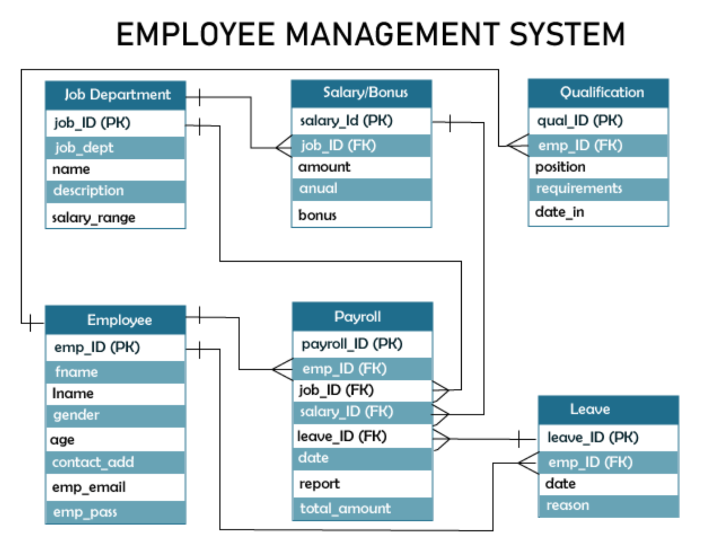

ER Diagram (Entity Relationship diagram)

# The Employee Management systems provide some features. These features are as below.

- Employee management: With the help of these features, the system can gather information about the employees. With the help of this information, the system can track the job performance of the employee and other important matters regarding the system. It also checks the attendance of the employees.
- Manage salaries and bonuses: The management of bonuses and salaries can be done by the admin. With the help of the employee management system, the admin can track the company's expenses and wages. This overall process helps the company distribute salaries among the employees and other matters regarding the employees' salaries.
- Manage job department and status: With the help of this feature, the system can manage and monitor the job status of every employee. This system also helps to calculate the salary for the employee based on the range of their labor or per month. This system also records all the expenses of the company and stores these data in the company database.
- Manage and monitor transaction records: With the help of this feature, the admin can track every transaction made by the employee with the service offered to their customer. This system also records the attendance and leaves of the employees.